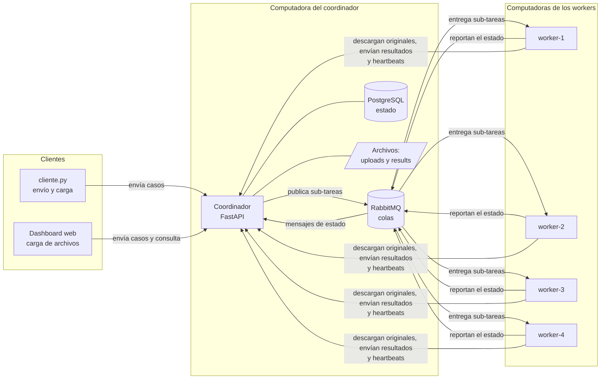
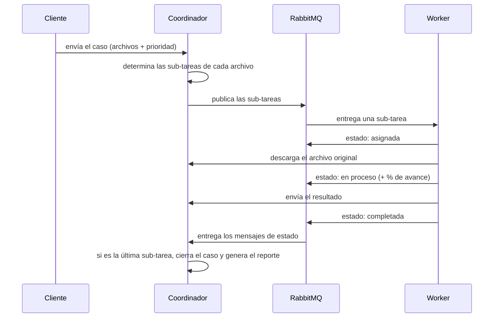
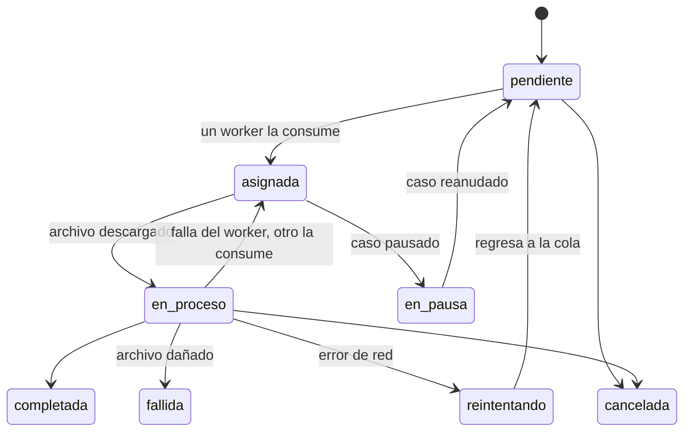
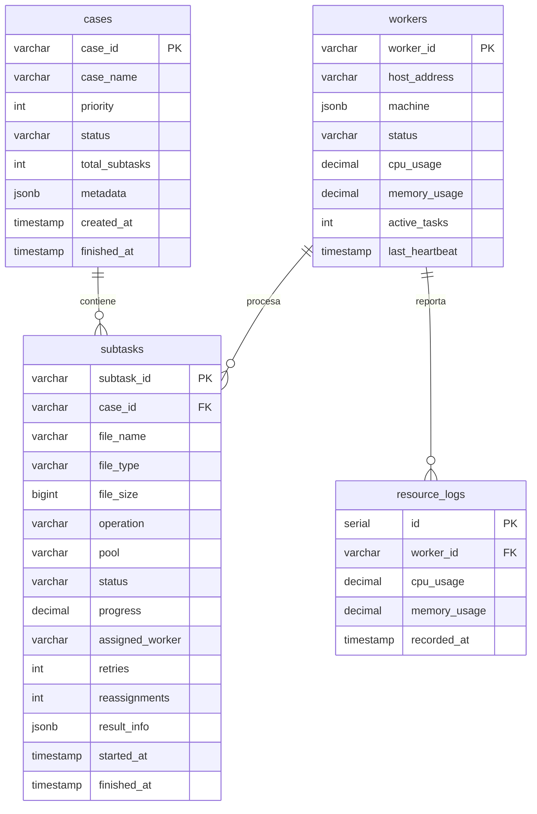

# Documento de arquitectura

**Plataforma Distribuida de Procesamiento Multimedia por Casos y Monitoreo Cooperativo de Recursos**

IC-6600 Principios de Sistemas Operativos · TEC Campus San Carlos · II Semestre 2026

### Contenido

1. [Componentes](#1-componentes)
2. [Flujo de procesamiento de un caso](#2-flujo-de-procesamiento-de-un-caso)
3. [Operaciones por tipo de archivo](#3-operaciones-por-tipo-de-archivo)
4. [Distribución del trabajo](#4-distribución-del-trabajo-relación-con-la-unidad-1)
5. [Prioridades](#5-prioridades)
6. [Estados y sincronización](#6-estados-y-sincronización)
7. [Manejo de fallos](#7-manejo-de-fallos)
8. [Monitoreo y reacción a la carga](#8-monitoreo-y-reacción-a-la-carga)
9. [Almacenamiento de resultados y reporte](#9-almacenamiento-de-resultados-y-reporte)
10. [Base de datos](#10-base-de-datos)
11. [API](#11-api)
12. [Relación con los temas del curso](#12-relación-con-los-temas-del-curso)

---

## Resumen

El usuario envía un **caso**: un conjunto de archivos relacionados, por ejemplo el material de un evento (videos, canciones y fotografías). El **coordinador** analiza cada archivo, determina las operaciones que corresponden según su tipo y divide el caso en **sub-tareas**. Las sub-tareas se publican en **colas** de RabbitMQ. Cuatro **workers**, ubicados en cuatro computadoras distintas, consumen sub-tareas de esas colas y las procesan **de forma concurrente** con FFmpeg. Cuando finalizan **todas** las sub-tareas del caso, el coordinador lo cierra y genera un **reporte consolidado**. Un **dashboard** web muestra el estado del sistema en tiempo real.

## Glosario

| Término | Definición |
|---|---|
| **Caso** | Solicitud del usuario compuesta por uno o varios archivos que se procesan en conjunto. Es **homogéneo** si todos los archivos son del mismo tipo y **heterogéneo** si combina video, audio e imágenes. |
| **Sub-tarea** | Operación sobre un archivo, por ejemplo la conversión de un video a MKV. Un caso genera varias. |
| **Coordinador** | Programa central (`coordinador/app.py`). Recibe los casos, distribuye el trabajo, consolida los resultados y sirve el dashboard. |
| **Worker** | Programa (`worker/worker.py`) que se ejecuta en cada computadora y realiza el procesamiento. |
| **Cola** | Estructura de RabbitMQ donde las sub-tareas esperan hasta que un worker las consume. |
| **Pool** | Cada una de las tres colas de trabajo, clasificadas por tipo de carga: video, audio o ligera. |
| **Heartbeat** | Mensaje periódico (cada 5 segundos) con el que cada worker confirma que sigue activo y reporta su uso de CPU y RAM. |
| **Barrier/join** | Mecanismo de sincronización que impide cerrar un caso hasta que todas sus sub-tareas hayan finalizado. |
| **FFmpeg** | Herramienta de conversión y análisis de audio y video. |

---

## 1. Componentes

| Componente | Tecnología | Función |
|---|---|---|
| **Coordinador** | Python + FastAPI | Recibe los casos, determina las operaciones de cada archivo, distribuye el trabajo, consolida los resultados, genera los reportes y sirve el dashboard |
| **Colas** | RabbitMQ | Almacena las sub-tareas pendientes hasta que un worker las consume. Hay tres colas de trabajo (`tareas.video`, `tareas.audio`, `tareas.ligera`) y una de resultados (`results`) |
| **Base de datos** | PostgreSQL | Almacena el estado de casos, sub-tareas y workers, y el historial de CPU y RAM |
| **Workers** | Python + FFmpeg (con o sin Docker) | Consumen sub-tareas, las procesan y reportan el resultado |
| **Archivos** | Directorios del coordinador | `uploads/` contiene los originales; `results/` contiene los resultados y el reporte de cada caso |
| **Dashboard** | Página web del coordinador | Envío de casos y monitoreo en tiempo real |
| **Cliente** | `cliente/cliente.py` | Envío de casos desde la terminal, generación de carga y medición de tiempos |

**Comunicación:** toda la comunicación se realiza **por red**. Los workers no comparten disco con el coordinador.

- Mediante **RabbitMQ** (puerto 5672) reciben las sub-tareas y reportan su estado.
- Mediante **HTTP** (puerto 8000) descargan el archivo original, envían el resultado, informan el porcentaje de avance y envían el heartbeat.

**Despliegue:** RabbitMQ, PostgreSQL y el coordinador se ejecutan en una misma computadora, que también ejecuta worker-1. Los otros tres workers se ejecutan en tres computadoras adicionales: dos en la red local del TEC (worker-2 y worker-3) y una en otra red, conectada mediante la VPN Tailscale (worker-4).

---

## 2. Flujo de procesamiento de un caso

1. El usuario envía los archivos desde el dashboard o con el cliente.
2. El coordinador los almacena en `uploads/<caso>/`.
3. Identifica el tipo de cada archivo y determina sus sub-tareas ([sección 3](#3-operaciones-por-tipo-de-archivo)).
4. Registra el caso y las sub-tareas en la base de datos.
5. Publica cada sub-tarea en la cola correspondiente, con la prioridad del caso.
6. Un worker disponible consume una sub-tarea y notifica el cambio de estado a **asignada**.
7. El worker descarga el archivo original y notifica el estado **en proceso**. Durante el procesamiento informa el porcentaje de avance.
8. Al finalizar, envía el resultado al coordinador y notifica el estado **completada** o **fallida**, con el motivo del error.
9. Solo entonces confirma a RabbitMQ (ACK) que la sub-tarea fue procesada. Si el worker falla antes de ese punto, la sub-tarea regresa a la cola.
10. El coordinador actualiza la sub-tarea. Si era **la última** del caso, cierra el caso y genera el reporte.

---

## 3. Operaciones por tipo de archivo

El coordinador determina las operaciones según la **extensión** del archivo (función `determine_subtasks`):

| Tipo de archivo | Operaciones | Cola |
|---|---|---|
| **Video** (mp4, mkv, avi, mov) | 3 sub-tareas: **conversión** de formato (mp4 → mkv; mkv, avi, mov → mp4), **extracción del audio** a mp3 y selección de una **portada** | video |
| **Audio sin comprimir** (wav, flac, ogg) | **Conversión** a mp3 | audio |
| **Canción mp3** | Búsqueda de **metadatos**: álbum, fecha, género, versión y letra | ligera |
| **Imagen** (jpg, png) | Generación de una **miniatura** de 320 px | ligera |
| **Otro formato** (txt, pdf…) | Ninguna: el archivo se marca como **formato no soportado** y no ocupa ningún worker | — |

Un caso heterogéneo genera sub-tareas de distinto tipo y costo, que se procesan en paralelo en distintas computadoras.

### 3.1 Selección de la portada de un video

La portada no se toma de un cuadro arbitrario. El worker aplica el siguiente procedimiento con FFmpeg:

1. Analiza **5 posiciones** del video (10 %, 30 %, 50 %, 70 % y 90 % de su duración).
2. En cada posición evalúa 60 cuadros consecutivos con el filtro `thumbnail` de FFmpeg, que selecciona el **más representativo**: el más cercano al color promedio de la escena. De esta forma se descartan transiciones, fundidos y cuadros borrosos.
3. Entre los 5 candidatos selecciona el de **mayor nivel de detalle**: los codifica en JPEG y elige el archivo de mayor tamaño. Una imagen negra, blanca o uniforme se comprime mucho y produce un archivo pequeño; una imagen con personas o escenario, no.

El reporte indica el segundo del video del que se extrajo la portada.

### 3.2 Búsqueda de metadatos de una canción

Para cada archivo mp3 se combinan varias fuentes:

| Fuente | Información obtenida |
|---|---|
| **ffprobe** (parte de FFmpeg, local) | Datos técnicos: duración, calidad, formato, y el título y artista incluidos en el archivo |
| **iTunes Search API** (servicio público y gratuito) | A partir del título y el artista: **álbum, fecha, género, número de pista y carátula** |
| **MusicBrainz** (base de datos musical abierta) | La misma información, como respaldo cuando iTunes no encuentra la canción |
| **lyrics.ovh** (servicio público) | La **letra** de la canción |

También se detecta si se trata de una **versión** acústica, en vivo, remix o instrumental. El reporte lo resume de esta forma: *Álbum: Parachutes (2000) · Género: Alternative · Letra: sí · Fuente: iTunes*. Si no hay conexión a internet o la canción no existe en esos servicios, **la sub-tarea no falla**: entrega los datos técnicos e indica que no hubo coincidencia.

### 3.3 Metadatos del caso

Cada caso puede incluir información adicional (evento, sesión, usuario, lote y datos de cada archivo, como título o autor). Esta información se almacena con el caso y se incluye en el reporte.

---

## 4. Distribución del trabajo (relación con la Unidad 1)

### Decisión de diseño: workers genéricos y colas por tipo de carga

**Los cuatro workers pueden ejecutar cualquier operación**: conversión de video, conversión de audio, miniaturas o metadatos. Sin embargo, las sub-tareas no se publican en una única cola, sino en **tres colas según su costo computacional**:

| Cola | Operaciones | Costo |
|---|---|---|
| `video` | Conversión de video, extracción de audio, portada | **Alto**: utiliza toda la CPU disponible; tarda desde segundos hasta varios minutos |
| `audio` | Conversión de wav, flac u ogg a mp3 | Medio |
| `ligera` | Miniaturas y metadatos | Bajo: milisegundos o pocos segundos |

Cada worker consume de las tres colas.

### Justificación de los workers genéricos

Las cuatro computadoras del equipo son de uso personal y ninguna tiene una ventaja de hardware clara, como una GPU dedicada, que justifique asignarle un tipo de trabajo exclusivo. Además, la composición de la carga varía mucho entre casos: un caso puede contener casi solo imágenes y el siguiente casi solo video.

- **Ningún worker queda inactivo** mientras exista trabajo de cualquier tipo.
- **Si una computadora falla, las demás continúan con todo el trabajo**, porque todas pueden ejecutar cualquier operación. Con un único worker dedicado a video, una falla de ese equipo dejaría los videos pendientes de forma indefinida.
- **El despliegue es más simple:** los cuatro workers se ejecutan con la misma configuración.

### Justificación de las tres colas

En la Unidad 1 se estudió que no todo el trabajo aprovecha los recursos de la misma forma: una GPU es adecuada para ciertas cargas y una NPU para otras. En este proyecto ocurre algo similar: la conversión de video es muy costosa, mientras que una miniatura casi no consume recursos. Separar las sub-tareas en colas cumple tres objetivos:

- **Evitar que las tareas cortas esperen detrás de las largas.** Con una única cola, una miniatura de un segundo podría quedar detrás de cinco videos de 10 minutos. Con colas separadas, el primer worker disponible la procesa de inmediato.
- **Identificar cuellos de botella.** El dashboard muestra cuántas sub-tareas esperan en cada cola.
- **Permitir la especialización a futuro.** Si se incorporara una computadora considerablemente más potente, podría dedicarse solo a video (`WORKER_POOLS=video WORKER_CONCURRENCY=2`) sin otros cambios. La comparación de ambas configuraciones con datos queda como prueba pendiente (ver el Informe de pruebas).

### Balanceo de carga

- RabbitMQ entrega a cada worker **una sola sub-tarea a la vez** (o la cantidad definida en `WORKER_CONCURRENCY`). La siguiente sub-tarea se entrega al primer worker que finaliza, por lo que **el worker más rápido procesa más tareas** sin necesidad de una asignación manual.
- Si un worker alcanza un uso de CPU elevado, deja de solicitar trabajo temporalmente ([sección 8](#8-monitoreo-y-reacción-a-la-carga)).

> [!NOTE]
> **Detalle técnico:** se utiliza `prefetch_count = WORKER_CONCURRENCY` con QoS global por canal. Cada sub-tarea se procesa en un hilo independiente, y el hilo principal atiende la conexión con RabbitMQ.

---

## 5. Prioridades

Cada caso tiene una prioridad de **1 (baja) a 10 (alta)**. Las colas de RabbitMQ respetan esa prioridad: **un caso urgente que llega después se procesa antes** que los casos que ya estaban en espera.

> [!NOTE]
> **Detalle técnico:** colas durables con `x-max-priority = 10` y mensajes persistentes, de modo que no se pierden si RabbitMQ se reinicia.

---

## 6. Estados y sincronización

### Estados de una sub-tarea

| Estado | Descripción |
|---|---|
| `pendiente` | En la cola, a la espera de un worker |
| `asignada` | Un worker la consumió |
| `en proceso` | El worker descargó el archivo y la está procesando (muestra el porcentaje) |
| `completada` | Finalizó correctamente |
| `fallida` | No se pudo procesar (archivo dañado, formato no soportado…) |
| `reintentando` | Falló por un problema transitorio (por ejemplo, de red) y se volverá a intentar |
| `en pausa` | El caso está pausado: la sub-tarea espera a que se reanude |
| `cancelada` | El usuario canceló el caso |

### Estados de un caso

| Estado | Descripción |
|---|---|
| `en cola` | Recién registrado |
| `en proceso` | Tiene sub-tareas sin finalizar |
| `reintentando` | Tiene sub-tareas sin finalizar y al menos una en espera de reintento |
| `en pausa` | El usuario lo pausó: las sub-tareas en ejecución finalizan y las demás esperan |
| `completado` | Todas las sub-tareas finalizaron **correctamente** |
| `parcialmente completado` | Todas las sub-tareas finalizaron y **al menos una falló** |
| `fallido` | Todas las sub-tareas finalizaron y **ninguna fue exitosa** |
| `cancelado` | El usuario lo canceló |

### Barrier/join: cierre de un caso

Las sub-tareas de un caso finalizan en cualquier orden y en distintas computadoras: una puede tardar 1 segundo y otra 20 minutos. El coordinador **no puede cerrar el caso hasta que finalicen todas**; esa espera constituye la **barrera**. Cuando se cumple, el coordinador **consolida** los resultados (*join*), determina el estado final y genera el reporte.

Por cada mensaje de estado recibido de un worker, el coordinador:

1. Verifica que la sub-tarea no estuviera ya en un estado final. Si lo estaba, descarta el mensaje por duplicado (por ejemplo, el de una sub-tarea redistribuida).
2. Actualiza la sub-tarea.
3. Cuenta cuántas sub-tareas del caso han finalizado.
4. Si finalizaron **todas**, cierra el caso y genera el reporte. En caso contrario, espera el siguiente mensaje.

> [!NOTE]
> **Detalle técnico:** cada mensaje se procesa en una transacción que bloquea la fila del caso (`SELECT … FOR UPDATE`), de modo que dos mensajes simultáneos no produzcan condiciones de carrera. La lógica está en `refresh_case_status`.

---

## 7. Manejo de fallos

| Situación | Respuesta del sistema |
|---|---|
| **Falla de un worker** durante una sub-tarea | Como la sub-tarea no fue confirmada (ACK), RabbitMQ **la entrega a otro worker**. Queda registrada como redistribuida. |
| **Falla temporal de red** | La sub-tarea pasa a `reintentando` y se vuelve a intentar a los 5 s y luego a los 10 s. Si el error persiste, queda como fallida. |
| **Archivo dañado** | Falla de forma definitiva, ya que un reintento no lo corregiría. |
| **Mensaje duplicado** | Se descarta. |
| **Cancelación** de un caso | Las sub-tareas que no iniciaron ya no se procesan. Si un worker consume una de ellas, el coordinador le indica que el caso está cancelado y el worker la descarta. |
| **Pausa** de un caso | Las sub-tareas en ejecución finalizan. Si un worker consume una sub-tarea de ese caso, el coordinador le indica que el caso está en pausa y el worker la devuelve sin procesarla, con lo que queda disponible para otros casos. Al **reanudar**, el coordinador vuelve a publicar solo las sub-tareas devueltas; las que nunca salieron de la cola permanecen en ella, por lo que ninguna se procesa dos veces. |
| **Ausencia de heartbeat** durante 15 s | El worker se muestra como **desconectado**. |
| **Sub-tareas de larga duración** (videos de 500 MB) | Por defecto, RabbitMQ devuelve a la cola cualquier mensaje sin confirmar después de 30 minutos. Al iniciar, el coordinador amplía ese límite a 4 horas para evitar que las conversiones largas se repitan. |
| **Archivos de gran tamaño** | Se transfieren **por bloques** de 1 MB, nunca completos en memoria, para no saturar la RAM. |

---

## 8. Monitoreo y reacción a la carga

**Métricas:** cada worker envía cada 5 segundos su uso de **CPU y RAM**, la cantidad de tareas en ejecución y los datos de su equipo (procesador, núcleos, RAM). El coordinador almacena el estado actual y el historial. Además, registra **la dirección IP de origen de cada worker**, lo que evidencia que se ejecutan en computadoras distintas.

**Reacción:** si un worker supera el **80 % de CPU** en dos mediciones consecutivas, **deja de solicitar trabajo nuevo** y se muestra como **saturado**. RabbitMQ entrega entonces las sub-tareas a los demás workers. Cuando el uso baja del **60 %**, el worker vuelve a solicitar trabajo.

**Información del dashboard:**

- Tarjetas con totales: casos, workers activos y archivos procesados.
- Cantidad de sub-tareas en espera en cada cola.
- Workers: IP, equipo, estado, CPU, RAM y tareas procesadas.
- Casos, con su avance y su detalle.
- Gráficos de la variedad de archivos (tipos, formatos y tamaños).
- Trazabilidad: un mapa de qué worker procesó cada archivo y una línea de tiempo que muestra las sub-tareas ejecutadas en paralelo.

---

## 9. Almacenamiento de resultados y reporte

- **Originales:** `uploads/<caso>/`. Los workers los descargan del coordinador.
- **Resultados:** los workers los envían al coordinador y se almacenan en `results/<caso>/`. Se descargan desde el dashboard o con el cliente.
- **Justificación del almacenamiento central:** el coordinador es el único equipo que permanece encendido durante toda la ejecución, por lo que los resultados se pueden recuperar aunque un worker se apague. Además, no es necesario configurar directorios compartidos entre computadoras.
- **Reporte del caso:** se genera cuando el caso finaliza. Incluye:
  - fechas de inicio y fin;
  - un **resumen de una línea**, por ejemplo: *De 15 archivos — 4 videos convertidos, 6 miniaturas generadas…; 1 fallido por formato no soportado*;
  - el resultado de cada sub-tarea, con su worker y sus tiempos;
  - la carga procesada por cada worker;
  - los errores y los metadatos.
- El reporte se puede consultar como página web imprimible, descargar en JSON, y se guarda en `results/<caso>/reporte_<caso>.json`.

---

## 10. Base de datos

| Tabla | Contenido |
|---|---|
| `cases` | Un registro por caso |
| `subtasks` | Un registro por sub-tarea, con su estado, worker, tiempos y resultado |
| `workers` | Estado actual de cada worker |
| `resource_logs` | Historial de uso de CPU y RAM |

Si la base de datos se creó con una versión anterior, el coordinador agrega automáticamente las columnas faltantes al iniciar.

---

## 11. API

El coordinador expone los siguientes endpoints. La documentación interactiva está disponible en `http://<coordinador>:8000/docs`.

| Método | Ruta | Descripción |
|---|---|---|
| `POST` | `/api/cases` | Envía un caso (archivos, nombre, prioridad 1–10 y metadatos opcionales) |
| `GET` | `/api/cases` | Lista los casos |
| `GET` | `/api/cases/{id}` | Consulta un caso y sus sub-tareas |
| `POST` | `/api/cases/{id}/pause` · `/api/cases/{id}/resume` | Pausa o reanuda un caso |
| `POST` | `/api/cases/{id}/cancel` | Cancela un caso |
| `DELETE` | `/api/cases/{id}` | Elimina un caso y sus archivos |
| `GET` | `/api/cases/{id}/report` | Reporte en JSON |
| `GET` | `/cases/{id}/reporte` | Reporte como página web |
| `GET` | `/api/stats` | Totales y estado de las colas |
| `GET` | `/api/workers` | Lista de workers |
| `GET` | `/api/dataset` | Datos de los gráficos de variedad |
| `GET` | `/api/trace` | Datos de trazabilidad |
| `GET` | `/api/results/{sub-tarea}` | Descarga un resultado |
| *(workers)* | `/api/workers/heartbeat`, `/api/files/...`, `/api/results/{id}/raw`, `/api/subtasks/{id}/progress` | Heartbeat, descarga de originales, envío de resultados y reporte de avance |

---

## 12. Relación con los temas del curso

| Tema del curso | Aplicación en el proyecto |
|---|---|
| Procesos | Cada worker es un proceso independiente en otra computadora; FFmpeg se ejecuta como proceso hijo |
| Estados de trabajos | Estados de sub-tarea y de caso ([sección 6](#6-estados-y-sincronización)) |
| Planificación | Operaciones por tipo de archivo, colas por tipo de carga y prioridades |
| Colas | RabbitMQ, con prioridad y confirmación al finalizar |
| Concurrencia | Varias sub-tareas y varios casos procesados de forma simultánea |
| Sincronización | Barrier/join: el caso se cierra solo cuando finalizan todas sus sub-tareas |
| Comunicación entre procesos | Mensajes por RabbitMQ y solicitudes HTTP, siempre por red |
| Recursos y heterogeneidad | Colas según el costo de la tarea; pausa automática ante CPU elevada |
| Monitoreo y balanceo | Heartbeats, dashboard y asignación al primer worker disponible |
| Sistemas distribuidos | Cuatro computadoras (una conectada por VPN), tolerancia a fallos y redistribución de tareas |
| Archivos | Repositorio de originales y resultados, reportes y metadatos |
