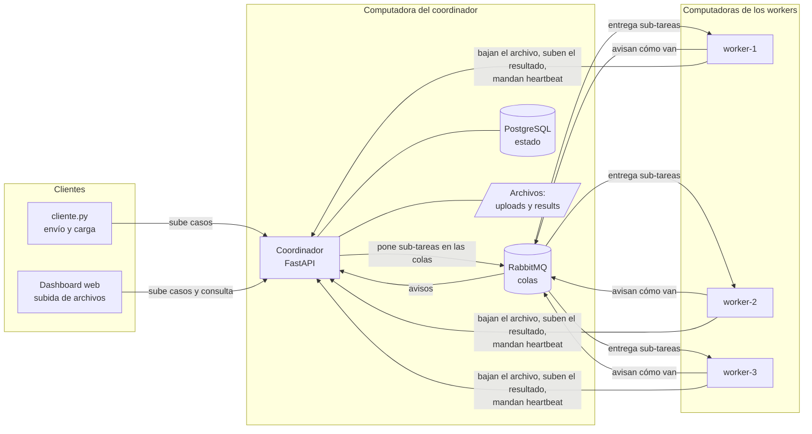
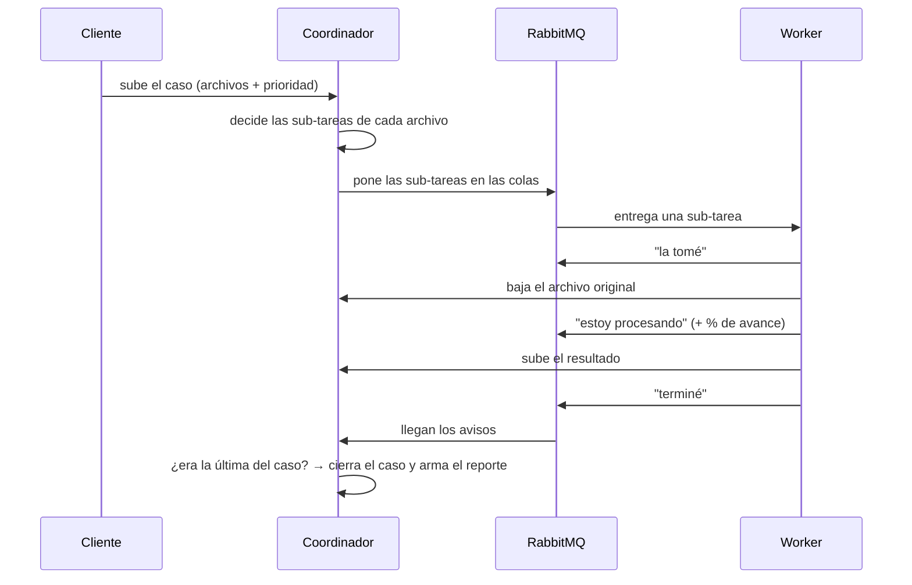
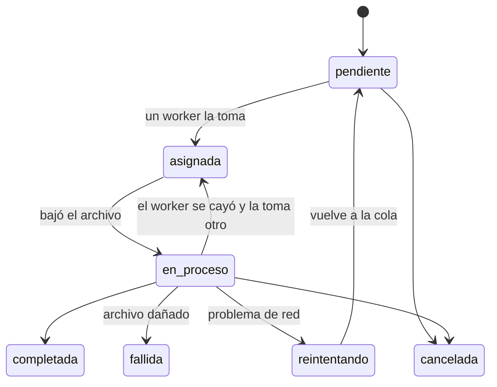
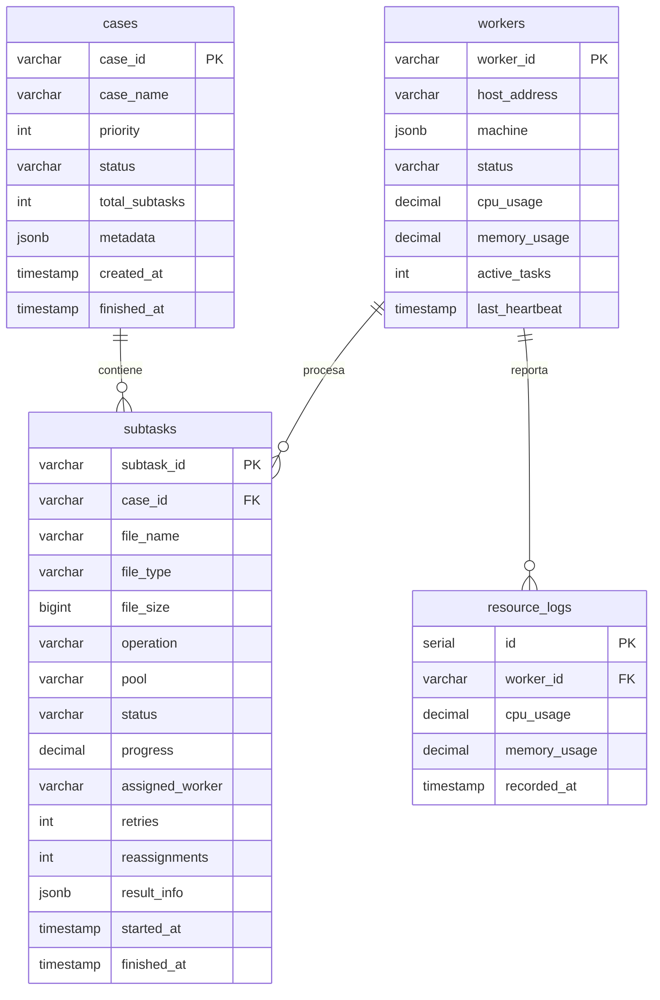

# Documento de arquitectura

**Plataforma Distribuida de Procesamiento Multimedia por Casos y Monitoreo Cooperativo de Recursos**
IC-6600 Principios de Sistemas Operativos · TEC Campus San Carlos · II Semestre 2026

---

## Resumen en un párrafo

El usuario sube un **caso**: un grupo de archivos relacionados, por ejemplo todo el material de un evento (videos, canciones y fotos). Un **coordinador** revisa cada archivo, decide qué hacerle según su tipo y lo divide en **sub-tareas** chicas. Esas sub-tareas se ponen en **filas de espera** (colas de RabbitMQ). Tres **workers**, cada uno en una computadora distinta, van tomando sub-tareas de esas filas y las procesan **al mismo tiempo** con FFmpeg. Cuando terminan **todas** las sub-tareas del caso, el coordinador lo da por cerrado y genera un **reporte**. Un **dashboard** web muestra todo en vivo.

## Glosario

| Término | Qué significa aquí |
|---|---|
| **Caso** | Un pedido del usuario: uno o varios archivos que se procesan juntos. **Homogéneo** si son todos del mismo tipo; **heterogéneo** si mezcla video, audio e imágenes. |
| **Sub-tarea** | Una operación sobre un archivo, por ejemplo "convertir este video a MKV". Un caso tiene muchas. |
| **Coordinador** | El programa central (`coordinador/app.py`). Recibe casos, reparte el trabajo, junta los resultados y sirve el dashboard. |
| **Worker** | Un programa (`worker/worker.py`) que corre en cada computadora y hace el trabajo pesado. |
| **Cola** | Una fila de espera donde las sub-tareas aguardan a que un worker las tome. La maneja **RabbitMQ**. |
| **Pool** | Cada una de las tres colas de trabajo, según el tipo de carga: `video`, `audio` o `ligera`. |
| **Heartbeat** | Un aviso que cada worker manda cada 5 segundos ("sigo vivo, uso tanto de CPU y RAM"). |
| **Barrier/join** | La regla de "no cerrar el caso hasta que terminen todas sus sub-tareas". |
| **FFmpeg** | La herramienta que convierte y analiza audio y video. |

---

## 1. Componentes

| Pieza | Tecnología | Qué hace |
|---|---|---|
| **Coordinador** | Python + FastAPI | Recibe los casos, decide qué hacer con cada archivo, reparte, junta resultados, arma reportes y sirve el dashboard |
| **Colas** | RabbitMQ | Guarda las sub-tareas en espera hasta que un worker las toma. Hay tres colas de trabajo (`tareas.video`, `tareas.audio`, `tareas.ligera`) y una de avisos (`results`) |
| **Base de datos** | PostgreSQL | Guarda el estado de casos, sub-tareas y workers, y el historial de CPU y RAM |
| **Workers** | Python + FFmpeg (con o sin Docker) | Toman sub-tareas, las procesan y avisan el resultado |
| **Archivos** | Carpetas del coordinador | `uploads/` guarda los originales; `results/` guarda los resultados y el reporte de cada caso |
| **Dashboard** | Página web del coordinador | Subir casos y ver todo en vivo |
| **Cliente** | `cliente/cliente.py` | Mandar casos desde la terminal, generar carga y medir tiempos |

**Cómo se conectan:** todo es **por red**. Los workers no comparten disco con el coordinador.
- Por **RabbitMQ** (puerto 5672) reciben las sub-tareas y avisan cómo van.
- Por **HTTP** (puerto 8000) bajan el archivo original, suben el resultado, informan el % de avance y mandan el heartbeat.

**Despliegue:** RabbitMQ, PostgreSQL y el coordinador corren en una computadora. Cada integrante corre un worker en su propia computadora.

---

## 2. Qué pasa cuando llega un caso, paso a paso

1. El usuario sube los archivos (desde el dashboard o con el cliente).
2. El coordinador los guarda en `uploads/<caso>/`.
3. Mira el tipo de cada archivo y decide sus sub-tareas (sección 3).
4. Registra el caso y las sub-tareas en la base de datos.
5. Pone cada sub-tarea en la cola que le corresponde, con la prioridad del caso.
6. Un worker libre toma una sub-tarea y avisa: **"la tomé"** (asignada).
7. El worker baja el archivo y avisa: **"estoy procesando"**. Mientras trabaja, informa el % de avance.
8. Al terminar, sube el resultado al coordinador y avisa: **"terminé"** (o "falló", con el motivo).
9. Recién ahí le confirma a RabbitMQ que la tarea está hecha. Así, si el worker se cae antes, la tarea vuelve a la cola.
10. El coordinador actualiza la sub-tarea. Si era **la última** del caso, lo cierra y genera el reporte.

---

## 3. Qué se le hace a cada archivo

El coordinador decide por la **extensión** del archivo (función `determine_subtasks`):

| Si el archivo es… | Se le hace | Cola |
|---|---|---|
| **Video** (mp4, mkv, avi, mov) | 3 sub-tareas: **convertir** de formato (mp4 → mkv; mkv, avi, mov → mp4), **extraer el audio** a mp3 y sacar una **portada** | `video` |
| **Audio sin comprimir** (wav, flac, ogg) | **Convertir** a mp3 | `audio` |
| **Canción mp3** | Buscar sus **metadatos**: álbum, fecha, género, versión y letra | `ligera` |
| **Imagen** (jpg, png) | Hacer una **miniatura** de 320 px | `ligera` |
| **Otra cosa** (txt, pdf…) | Nada: queda marcado como **"formato no soportado"**, sin ocupar a ningún worker | — |

Un caso heterogéneo genera sub-tareas de distinto tipo y peso, que se procesan en paralelo en distintas computadoras.

### 3.1 Cómo se elige la portada de un video

No se toma un cuadro cualquiera. El worker usa FFmpeg así:

1. Mira **5 momentos** del video (al 10 %, 30 %, 50 %, 70 % y 90 %).
2. En cada momento analiza 60 cuadros seguidos con el filtro `thumbnail` de FFmpeg, que elige el **más representativo**: el que más se parece al color promedio de esa escena. Así descarta transiciones, fundidos o cuadros borrosos.
3. De esos 5 candidatos se queda con el que tiene **más detalle**: lo guarda en JPEG y elige el archivo más grande. Una imagen negra, blanca o lisa comprime mucho y queda chica; una con personas o escenario, no.

El reporte dice en qué segundo del video se tomó la portada.

### 3.2 Cómo se buscan los metadatos de una canción

Para cada mp3 se combinan varias fuentes:

| Fuente | Qué da |
|---|---|
| **ffprobe** (parte de FFmpeg, local) | Datos técnicos: duración, calidad, formato, y el título y artista que trae el archivo |
| **iTunes** (servicio público y gratuito) | Con el título y el artista, busca el **álbum, la fecha, el género, el número de pista y la carátula** |
| **MusicBrainz** (base de datos musical abierta) | Lo mismo, como respaldo si iTunes no la encuentra |
| **lyrics.ovh** (servicio público) | La **letra** de la canción |

También detecta si es una **versión** acústica, en vivo, remix o instrumental. El reporte lo resume así: *"Álbum: Parachutes (2000) · Género: Alternative · Letra: sí · Fuente: iTunes"*. Si no hay internet o la canción no existe en esos servicios, **la tarea no falla**: entrega los datos técnicos e indica que no hubo coincidencia.

### 3.3 Metadatos del caso

Cada caso puede traer información extra (evento, sesión, usuario, lote y datos de cada archivo, como título o autor). Se guarda con el caso y aparece en el reporte.

---

## 4. Cómo se reparte el trabajo (conexión con la Unidad 1)

### La decisión: workers genéricos, colas por tipo de carga

**Los tres workers hacen de todo.** Cualquiera puede convertir un video, un audio o hacer una miniatura. Pero las sub-tareas no van a una sola fila, sino a **tres filas según cuánto cuestan**:

| Cola | Qué va ahí | Cuánto cuesta |
|---|---|---|
| `video` | convertir video, extraer audio, portada | **Mucho**: usa toda la CPU, tarda de segundos a muchos minutos |
| `audio` | convertir wav, flac u ogg a mp3 | Medio |
| `ligera` | miniaturas y metadatos | Poco: milisegundos o segundos |

Cada worker mira las tres colas y toma lo que haya.

### Por qué workers genéricos

Nuestras tres computadoras son de potencia parecida, y la carga cambia mucho de un caso a otro: uno puede ser casi todo fotos y el siguiente casi todo video.

- **Nadie se queda sin hacer nada** mientras haya trabajo de cualquier tipo.
- **Si se cae una computadora, las otras siguen con todo**, porque todas saben hacer todo. Si hubiera una sola "computadora de video" y se apagara, los videos quedarían esperando para siempre.
- **Es más simple:** los tres workers se lanzan igual.

### Por qué, aun así, tres colas separadas

En la Unidad 1 vimos que no todo el trabajo aprovecha igual los recursos: una GPU sirve para unas cosas, una NPU para otras. Acá pasa algo parecido: convertir video es muy costoso, y hacer una miniatura casi no cuesta nada. Separarlas en colas sirve para tres cosas:

- **Que lo rápido no espere detrás de lo lento.** Si hubiera una sola fila, una miniatura de un segundo podría quedar detrás de cinco videos de 10 minutos. Con colas separadas, el primer worker que se libera la toma enseguida.
- **Ver dónde está el cuello de botella.** El dashboard muestra cuántas sub-tareas esperan en cada cola.
- **Dejar abierta la especialización.** Si alguna vez tuviéramos una computadora mucho más potente, se la podría dedicar solo a video (`WORKER_POOLS=video WORKER_CONCURRENCY=2`) sin cambiar nada más. La prueba P4 del informe compara las dos opciones con datos.

### Cómo se equilibra la carga

- RabbitMQ le da a cada worker **solo una sub-tarea a la vez** (o las que diga `WORKER_CONCURRENCY`). La siguiente va al worker que termine primero, así que **el más rápido termina haciendo más**, sin que nadie lo decida a mano.
- Si un worker tiene la CPU al límite, deja de pedir trabajo por un rato (sección 8).

> *Detalle técnico:* se usa `prefetch_count = WORKER_CONCURRENCY` con QoS global por canal. Cada sub-tarea se procesa en un hilo, y el hilo principal atiende la conexión con RabbitMQ.

---

## 5. Prioridades

Cada caso tiene una prioridad de **1 (baja) a 10 (alta)**. Las colas de RabbitMQ respetan esa prioridad: **un caso urgente que llega después se procesa antes** que los que ya estaban esperando.

> *Detalle técnico:* colas durables con `x-max-priority = 10` y mensajes persistentes, así que no se pierden si se reinicia RabbitMQ.

---

## 6. Estados y sincronización

### Estados de una sub-tarea

| Estado | Significa |
|---|---|
| pendiente | está en la cola esperando |
| asignada | un worker la tomó |
| en proceso | el worker ya bajó el archivo y está trabajando (muestra el %) |
| completada | terminó bien |
| fallida | no se pudo (archivo dañado, formato no soportado…) |
| reintentando | falló por un problema pasajero (por ejemplo, de red) y se va a volver a intentar |
| en pausa | el caso está pausado: la tarea espera a que se reanude |
| cancelada | el usuario canceló el caso |

### Estados de un caso

| Estado | Significa |
|---|---|
| en cola | se acaba de registrar |
| en proceso | todavía hay sub-tareas sin terminar |
| reintentando | hay sub-tareas sin terminar y al menos una esperando reintento |
| en pausa | el usuario lo pausó: lo que estaba corriendo termina y lo demás espera |
| **completado** | terminaron todas y **todas salieron bien** |
| **parcialmente completado** | terminaron todas y **alguna falló** |
| **fallido** | terminaron todas y **ninguna salió bien** |
| cancelado | el usuario lo canceló |

### Barrier/join: no cerrar el caso antes de tiempo

Las sub-tareas de un caso terminan en cualquier orden y en distintas computadoras: una puede tardar 1 segundo y otra 20 minutos. El coordinador **no puede dar el caso por terminado hasta que terminen todas**. Esa espera es la **barrera**. Cuando se cumple, **junta** los resultados (el *join*), decide el estado final y arma el reporte.

Cada vez que llega un aviso de un worker, el coordinador:
1. Revisa que esa sub-tarea no estuviera ya terminada. Si lo estaba, ignora el aviso, porque es un duplicado (por ejemplo, de una tarea redistribuida).
2. Actualiza la sub-tarea.
3. Cuenta cuántas sub-tareas del caso terminaron.
4. Si terminaron **todas**, cierra el caso y genera el reporte. Si no, espera el siguiente aviso.

> *Detalle técnico:* cada aviso se procesa en una transacción que bloquea la fila del caso (`SELECT … FOR UPDATE`), para que dos avisos simultáneos no se pisen. Está en `refresh_case_status`.

---

## 7. Qué pasa cuando algo sale mal

| Situación | Qué hace el sistema |
|---|---|
| **Se cae un worker** a mitad de una tarea | Como no llegó a confirmarla, RabbitMQ **se la da a otro worker**. Queda registrado como "redistribuida". |
| **Falla la red** por un momento | La tarea pasa a "reintentando" y se vuelve a intentar a los 5 s y después a los 10 s. Si sigue fallando, queda como fallida. |
| **El archivo está dañado** | Falla definitivamente: reintentar no lo arreglaría. |
| **Llega un aviso repetido** | Se ignora. |
| **El usuario cancela** un caso | Lo que no empezó ya no se procesa. El worker que tome una de esas tareas recibe "caso cancelado" y la descarta. |
| **El usuario pausa** un caso | Lo que ya está corriendo termina. Si un worker toma una tarea de ese caso, el coordinador le responde "caso en pausa" y el worker la devuelve sin procesarla, así queda libre para otros casos. Al **reanudar**, el coordinador vuelve a poner en la cola solo esas tareas devueltas; las que nunca salieron de la cola siguen ahí, así que ninguna se procesa dos veces. |
| **Un worker deja de mandar heartbeat** por 15 s | Aparece como **desconectado**. |
| **Tareas muy largas** (videos de 500 MB) | RabbitMQ, por defecto, devuelve a la cola cualquier tarea que tarde más de 30 minutos. El coordinador sube ese límite a 4 horas al arrancar, para que las conversiones largas no se repitan. |
| **Archivos muy grandes** | Viajan **por partes** (de a 1 MB), nunca enteros en memoria, para no saturar la RAM. |

---

## 8. Monitoreo y reacción a la carga

**Qué se mide:** cada worker manda cada 5 segundos su uso de **CPU y RAM**, cuántas tareas está haciendo y los datos de su computadora (procesador, núcleos, RAM). El coordinador guarda el estado actual y el historial. Además registra **desde qué IP llega cada worker**, la prueba de que están en computadoras distintas.

**Cómo reacciona:** si un worker supera el **80 % de CPU** en dos mediciones seguidas, **deja de pedir trabajo nuevo** y aparece como **saturado**. RabbitMQ le da las tareas a los otros workers. Cuando baja del **60 %**, vuelve a pedir trabajo.

**Qué muestra el dashboard:**
- Tarjetas con totales: casos, workers activos, archivos procesados.
- Cuántas sub-tareas esperan en cada cola.
- Los workers: IP, computadora, estado, CPU, RAM y tareas hechas.
- Los casos, con su avance y su detalle.
- Gráficos de la variedad de archivos (tipos, formatos y tamaños).
- Trazabilidad: un mapa de qué worker procesó cada archivo, y una línea de tiempo que muestra las tareas corriendo en paralelo.

---

## 9. Dónde quedan los resultados y el reporte

- **Originales:** `uploads/<caso>/`. Los workers los bajan del coordinador.
- **Resultados:** los workers los suben al coordinador y quedan en `results/<caso>/`. Se descargan desde el dashboard o con el cliente.
- **Por qué en el coordinador:** es la única computadora que siempre está encendida, así que los resultados se pueden recuperar aunque un worker se apague. No hace falta configurar carpetas compartidas entre computadoras distintas.
- **Reporte del caso:** se genera solo cuando el caso termina. Incluye:
  - fechas de inicio y fin;
  - un **resumen en una línea**, por ejemplo: *"De 15 archivos — 4 videos convertidos, 6 miniaturas generadas…; 1 fallido por formato no soportado"*;
  - el resultado de cada sub-tarea, con su worker y sus tiempos;
  - cuánto trabajó cada worker;
  - los errores y los metadatos.

  Se ve como página web imprimible, se descarga en JSON y se guarda en `results/<caso>/reporte_<caso>.json`.

---

## 10. Base de datos

- **cases:** un registro por caso.
- **subtasks:** uno por sub-tarea, con su estado, worker, tiempos y resultado.
- **workers:** el estado actual de cada worker.
- **resource_logs:** el historial de CPU y RAM.

Si la base se creó con una versión anterior, el coordinador agrega solo las columnas que falten al arrancar.

---

## 11. API

El coordinador ofrece estas direcciones. La documentación interactiva está en `http://<coordinador>:8000/docs`.

| Método | Dirección | Para qué |
|---|---|---|
| POST | `/api/cases` | Enviar un caso (archivos, nombre, prioridad 1–10 y metadatos opcionales) |
| GET | `/api/cases` | Listar los casos |
| GET | `/api/cases/{id}` | Ver un caso y sus sub-tareas |
| POST | `/api/cases/{id}/pause` · `/api/cases/{id}/resume` | Pausar / reanudar un caso |
| POST | `/api/cases/{id}/cancel` | Cancelar un caso |
| DELETE | `/api/cases/{id}` | Borrar un caso y sus archivos |
| GET | `/api/cases/{id}/report` | Reporte en JSON |
| GET | `/cases/{id}/reporte` | Reporte como página web |
| GET | `/api/stats` | Totales y estado de las colas |
| GET | `/api/workers` | Lista de workers |
| GET | `/api/dataset` | Datos de los gráficos de variedad |
| GET | `/api/trace` | Datos de la trazabilidad |
| GET | `/api/results/{sub-tarea}` | Descargar un resultado |
| *(workers)* | `/api/workers/heartbeat`, `/api/files/...`, `/api/results/{id}/raw`, `/api/subtasks/{id}/progress` | Heartbeat, bajar originales, subir resultados e informar avance |

---

## 12. Relación con los temas del curso

| Tema del curso | Dónde se ve en el proyecto |
|---|---|
| Procesos | Cada worker es un proceso independiente en otra computadora; FFmpeg corre como proceso hijo |
| Estados de trabajos | Los estados de sub-tarea y de caso (sección 6) |
| Planificación | Qué se le hace a cada archivo, las colas por tipo y las prioridades |
| Colas | RabbitMQ, con prioridad y confirmación al terminar |
| Concurrencia | Varias sub-tareas y varios casos procesándose a la vez |
| Sincronización | Barrier/join: el caso se cierra solo cuando terminan todas sus sub-tareas |
| Comunicación entre procesos | Mensajes por RabbitMQ y pedidos HTTP, siempre por red |
| Recursos y heterogeneidad | Colas según el costo de la tarea; pausa automática con CPU alta |
| Monitoreo y balanceo | Heartbeats, dashboard, reparto al que termina primero |
| Sistemas distribuidos | Tres computadoras, tolerancia a caídas, redistribución de tareas |
| Archivos | Repositorio de originales y resultados, reportes y metadatos |
