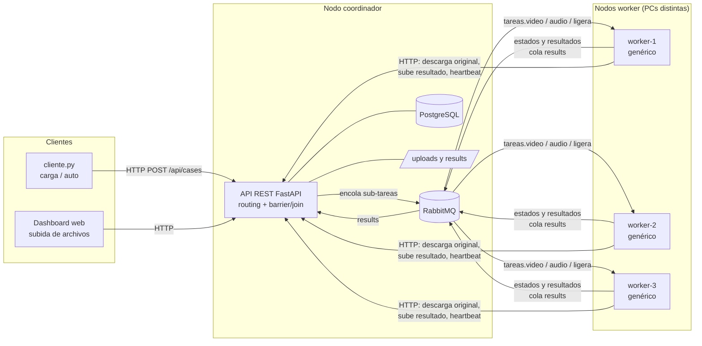
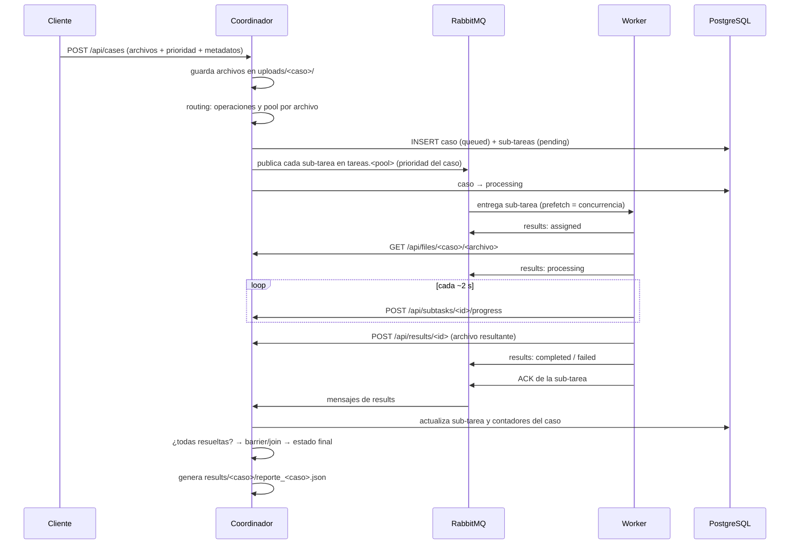
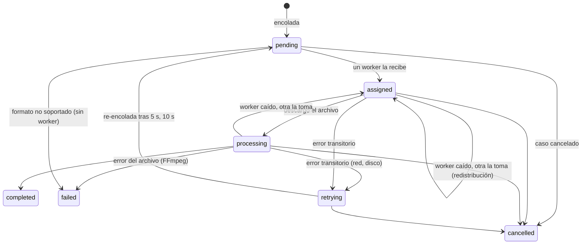
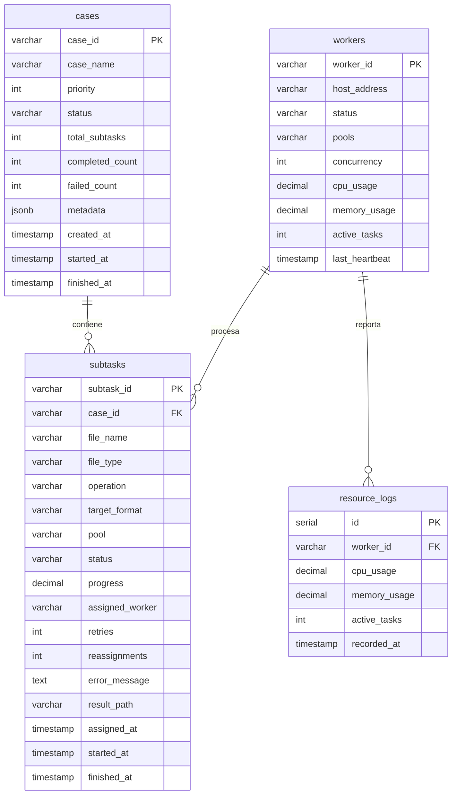

# Documento de arquitectura

**Plataforma Distribuida de Procesamiento Multimedia por Casos y Monitoreo Cooperativo de Recursos**
IC-6600 Principios de Sistemas Operativos · TEC Campus San Carlos · II Semestre 2026

---

## 1. Visión general

La unidad de trabajo es el **caso de procesamiento**: un conjunto de uno o varios archivos multimedia relacionados (homogéneos o heterogéneos) que se somete como una sola solicitud. El coordinador inspecciona cada archivo, lo descompone en **sub-tareas** según su tipo (*routing*), las encola en el **pool** que corresponde y cierra el caso solo cuando todas sus sub-tareas se resolvieron (**barrier/join**). Al cerrarse, genera un **reporte consolidado**.

| Componente | Tecnología | Responsabilidad |
|---|---|---|
| Coordinador | Python 3 + FastAPI | Recibe casos, hace routing, registra el caso, encola sub-tareas, escucha resultados (barrier/join), reintentos, cancelación, reportes, API y dashboard |
| Cola de trabajos | RabbitMQ | Tres colas de trabajo con prioridad (`tareas.video`, `tareas.audio`, `tareas.ligera`) y una de resultados (`results`) |
| Base de datos | PostgreSQL | Estado de casos, sub-tareas y workers; historial de recursos |
| Workers | Python 3 + FFmpeg (Docker opcional) | Consumen sub-tareas de sus pools, procesan con FFmpeg, informan estado/progreso, reportan CPU/RAM |
| Repositorio de resultados | Sistema de archivos del coordinador | `uploads/<caso>/` (originales) y `results/<caso>/` (resultados + `reporte_<caso>.json`) |
| Dashboard | HTML + JS servido por el coordinador | Envío de casos, monitoreo por caso / sub-tarea / worker / cola, trazabilidad, reportes |
| Cliente de pruebas | `cliente/cliente.py` | Envío manual, generación automática por metadatos, carga concurrente, métricas |

### Despliegue físico

- **Nodo coordinador:** RabbitMQ y PostgreSQL en Docker (`docker-compose.yml`) más el coordinador (`python coordinador/app.py`).
- **Nodos worker:** uno por integrante, cada uno en su computadora (con Docker o con Python), conectados por red al coordinador.

La comunicación es siempre por red: AMQP (puerto 5672) para las colas y HTTP (puerto 8000) para archivos, progreso y heartbeats. Los workers no comparten disco con el coordinador.

---

## 2. Flujo de un caso

---

## 3. Routing por tipo de contenido

El coordinador decide las operaciones por la extensión de cada archivo (`determine_subtasks` en `coordinador/app.py`):

| Tipo | Extensiones | Sub-tareas generadas | Pool |
|---|---|---|---|
| Video | mp4, mkv, avi, mov | conversión de formato (mp4↔mkv, avi/mov→mp4), extracción de audio (mp3) y portada elegida con criterio (ver 3.1) | `video` |
| Audio sin comprimir o libre | wav, flac, ogg | conversión a mp3 | `audio` |
| Audio mp3 | mp3 | metadatos técnicos y **asociados** (álbum, fecha, género, versión, letra; ver 3.2) | `ligera` |
| Imagen | jpg, jpeg, png | miniatura de 320 px | `ligera` |
| Otro | txt, pdf, … | ninguna: se marca **fallida por formato no soportado** en el mismo coordinador, sin ocupar un worker | — |

Un caso heterogéneo genera entonces sub-tareas de distinto tipo y peso que se ejecutan en paralelo en distintos workers. Un solo video produce tres sub-tareas independientes.

### 3.1 Portada de video con criterio

La portada no es un cuadro cualquiera. El worker:

1. Toma **5 ventanas** repartidas en el video (10 %, 30 %, 50 %, 70 % y 90 % de la duración).
2. En cada una aplica el filtro `thumbnail` de FFmpeg, que analiza 60 cuadros y conserva el **más representativo**: el más parecido al histograma de color promedio, lo que descarta cuadros de transición, desenfocados o de fundido.
3. Entre los 5 candidatos elige el de **mayor detalle visual**, medido por el tamaño del JPEG a igual resolución y calidad: un cuadro negro, en blanco o liso comprime muchísimo, y uno con contenido no.

El reporte indica en qué segundo se tomó la portada.

### 3.2 Asociación de metadatos e integración de letras

Para cada mp3, el worker combina tres fuentes:

| Fuente | Qué aporta |
|---|---|
| **ffprobe** (local) | Datos técnicos: duración, bitrate, códec, frecuencia, canales, y las etiquetas que trae el archivo |
| **API de búsqueda de iTunes** (pública, sin clave) | Datos asociados a partir del título y el artista: álbum, fecha de lanzamiento, género, número de pista, duración oficial y carátula |
| **MusicBrainz** (base de datos musical abierta) | Respaldo si iTunes no encuentra la canción o limita las consultas |
| **lyrics.ovh** (pública) | Letra de la canción |

También se detecta la **versión** (original, acústica, en vivo, remix, instrumental) a partir del título y del álbum. Todo se guarda en un JSON descargable, y el reporte muestra el resumen (por ejemplo, "Álbum: Parachutes (2000) · Género: Alternative · Letra: sí · Fuente: iTunes"). Si no hay internet o la canción no existe en esos servicios, la sub-tarea **no falla**: se entregan los metadatos técnicos y se indica que no hubo coincidencia.

### 3.3 Metadatos del caso

Además, cada caso puede traer **metadatos** (evento, sesión, usuario, lote y, por archivo, título, artista, álbum, etc.). Se guardan en `cases.metadata` (JSONB) y se integran en el reporte consolidado.

---

## 4. Modelo de asignación: workers genéricos sobre colas por tipo de carga (conexión con la Unidad 1)

### Decisión

El equipo eligió **workers genéricos**: los tres nodos atienden cualquier tipo de sub-tarea. Aun así, las sub-tareas no van a una sola cola, sino a **una cola por clase de carga** (pool):

| Pool | Carga | Perfil del recurso |
|---|---|---|
| `video` | transcodificación H.264, extracción de audio, portada | **CPU intensivo**, larga duración (segundos a minutos), escala con núcleos |
| `audio` | conversión wav/flac/ogg → mp3 | CPU moderado, duración media |
| `ligera` | miniaturas, metadatos | E/S y CPU breves (milisegundos) |

Cada worker se suscribe a las tres colas (`WORKER_POOLS` sin definir) y procesa hasta `WORKER_CONCURRENCY` sub-tareas a la vez.

### Justificación

**Por qué genéricos.** Los tres nodos son computadoras personales de capacidad parecida, y la carga de un caso heterogéneo es muy variable: un caso puede ser casi todo imágenes y el siguiente, casi todo video. Con workers especializados, un pool podría quedar saturado mientras los nodos de otro pool están ociosos, o sin ningún worker si se apaga el único nodo que lo atendía. Con workers genéricos:

- **Ningún nodo queda ocioso** mientras haya trabajo de cualquier tipo: el balanceo es máximo.
- **La tolerancia a fallos es total:** si cae un nodo, cualquiera de los otros puede retomar sus sub-tareas, porque todos atienden todo.
- **El despliegue es más simple:** todos los workers se lanzan igual.

**Por qué, aun así, colas separadas por tipo.** Siguiendo la discusión de la Unidad 1 sobre heterogeneidad de cómputo (CPU, GPU, NPU), no todas las operaciones tienen el mismo costo ni aprovechan igual los recursos. Separarlas en colas aporta:

- **Evitar el bloqueo en cola (*head-of-line blocking*).** Una miniatura de milisegundos no queda esperando detrás de varios videos de un minuto en una cola única. Como cada worker consume de las tres colas, la toma en cuanto queda libre.
- **Visibilidad por tipo de carga:** el dashboard muestra cuántas sub-tareas esperan en cada pool. Así se ve, por ejemplo, que el cuello de botella es el video.
- **Un camino abierto a la especialización:** si el equipo tuviera un nodo claramente más potente (o con GPU), bastaría con lanzarlo con `WORKER_POOLS=video WORKER_CONCURRENCY=2` para dedicarlo a la transcodificación, sin cambiar el coordinador. El sistema lo soporta. La prueba P4 del informe compara ambos modelos con datos.

La heterogeneidad que sí existe entre los nodos se maneja de forma dinámica, no estática: los nodos más rápidos terminan antes y, por el *prefetch* limitado, reciben más sub-tareas, y un nodo cuya CPU se satura deja de tomar trabajo temporalmente (sección 8).

### Balanceo de carga

- RabbitMQ entrega en *round-robin* entre los consumidores de cada cola. Con `prefetch_count = WORKER_CONCURRENCY` (QoS global por canal), un worker nunca acapara más sub-tareas de las que puede procesar, y las siguientes van al worker que se libere primero. Así, los nodos más rápidos procesan más.
- Cada sub-tarea se procesa en un hilo del worker. El hilo principal atiende la conexión AMQP y los heartbeats (pika no es *thread-safe*: los hilos publican mediante `add_callback_threadsafe`).

---

## 5. Colas y prioridades

- Las colas de trabajo se declaran durables y con `x-max-priority = 10`. Los mensajes son persistentes (`delivery_mode = 2`) y llevan la prioridad del caso (1 = baja, 10 = alta). RabbitMQ entrega primero los de mayor prioridad: un caso urgente enviado después adelanta a los que ya esperaban.
- La cola `results` concentra todos los cambios de estado que informan los workers. La consume un único hilo del coordinador, lo que serializa las actualizaciones de un mismo caso y simplifica la sincronización del barrier.

---

## 6. Estados y sincronización

### Sub-tarea

El progreso (%) de las conversiones se obtiene de la salida `-progress` de FFmpeg y se informa cada ~2 s.

### Caso (estado agregado)

| Estado | Cuándo |
|---|---|
| `queued` | registrado, sub-tareas encolándose |
| `processing` | hay sub-tareas sin resolver |
| `retrying` | hay sub-tareas sin resolver y al menos una en reintento |
| `completed` | todas las sub-tareas terminaron con éxito |
| `partially_completed` | todas terminaron y al menos una falló |
| `failed` | todas terminaron y ninguna tuvo éxito |
| `cancelled` | el usuario lo canceló |

### Barrier/join

Cada mensaje de la cola `results` se procesa en una transacción (`handle_worker_message` → `refresh_case_status`):

1. Se bloquea la fila de la sub-tarea (`SELECT … FOR UPDATE`). Si ya estaba en un estado final, el mensaje se descarta. Esto hace el procesamiento **idempotente** frente a re-entregas.
2. Se actualiza la sub-tarea.
3. Se bloquea la fila del caso y se cuentan sus sub-tareas por estado.
4. Solo si `completadas + fallidas = total` se decide el estado final y se registra `finished_at`. Antes de eso, el caso queda en `processing` o `retrying`.
5. Al cerrarse, se genera el reporte consolidado.

---

## 7. Tolerancia a fallos y redistribución

| Situación | Mecanismo |
|---|---|
| Un worker se cae a mitad de una sub-tarea | El worker hace el **ACK solo después** de publicar el resultado. Si la conexión se corta (heartbeat AMQP de 30 s), RabbitMQ **re-entrega** la sub-tarea a otro worker del mismo pool. El coordinador lo registra como redistribución (`reassignments`). |
| Error transitorio (red, disco) | El worker lo marca como `retryable`. El coordinador lo pasa a `retrying` y lo re-encola con espera creciente (5 s, 10 s), hasta `MAX_RETRIES = 2`. |
| Error del archivo (corrupto, códec) | Falla definitiva: reintentar no ayuda. |
| Mensajes duplicados | Se descartan si la sub-tarea ya está en un estado final. |
| Cancelación | Las sub-tareas sin terminar pasan a `cancelled`. El worker que tome una de la cola recibe `410 Gone` al descargar el archivo y la descarta sin procesarla. |
| Worker sin heartbeat por 15 s | Se marca `desconectado` (offline). Ya no cuenta como activo. |
| Sub-tareas muy largas (videos de 400–600 MB) | RabbitMQ re-entrega por defecto un mensaje sin confirmar después de 30 min (`consumer_timeout`), lo que haría rebotar una conversión larga. Al arrancar, el coordinador define una **política** que sube ese límite a 4 h para las colas de trabajo. |
| Archivos grandes en tránsito | Los archivos viajan por partes: el cliente sube el lote como flujo, los workers descargan de a 1 MB y suben el resultado sin cargarlo entero en memoria. |

---

## 8. Monitoreo de recursos y reacción a la carga

- Cada worker envía un **heartbeat** cada ~5 s con: CPU, memoria, sub-tareas activas, pools, concurrencia, versión y si está saturado. Se guarda el estado actual (`workers`) y el historial (`resource_logs`).
- **Reacción a la saturación:** si la CPU de un worker supera `CPU_HIGH` (**80 %**) en dos mediciones seguidas, el worker **cancela su suscripción** a las colas y deja de recibir sub-tareas nuevas. RabbitMQ se las entrega a los demás workers (**redistribución de carga**). Cuando la CPU baja de `CPU_LOW` (60 %), vuelve a suscribirse. En el dashboard aparece como `saturado`, y la cola muestra un consumidor menos.
- El dashboard muestra: tarjetas globales, **colas por pool** (en espera y consumidores), workers (estado, pools, CPU, RAM, tareas activas, sub-tareas procesadas, versión), casos con desglose de sub-tareas (en espera, en ejecución, completadas, fallidas), detalle por sub-tarea con progreso, y una **trazabilidad** con mapa de flujo (caso → archivo → sub-tarea → worker) y línea de tiempo por worker que evidencia el paralelismo.

---

## 9. Repositorio de resultados y reporte consolidado

- **Originales:** `uploads/<caso>/<archivo>`. Los workers los descargan por HTTP (`GET /api/files/...`).
- **Resultados:** los workers suben cada salida (`POST /api/results/<sub-tarea>`), que queda en `results/<caso>/<sub-tarea>_<archivo>.<ext>`. La ruta se asocia a la sub-tarea en la BD y se descarga con `GET /api/results/<sub-tarea>`.
- **Justificación:** se centraliza en el coordinador porque es el único nodo siempre disponible y ya concentra el estado. Esto evita depender de que un worker siga encendido para recuperar lo que procesó, y de configurar un sistema de archivos compartido entre PCs heterogéneas. El costo es el tráfico de red hacia el coordinador, aceptable para el volumen del proyecto.
- **Reporte consolidado** (`build_report`): identificador del caso; creación, inicio y fin; resumen agregado en una línea; archivos agrupados por tipo y operación; resultado, worker, tiempos y error de cada sub-tarea; reparto por worker; fallos por motivo; reintentos y redistribuciones; speedup; y metadatos asociados. Disponible en JSON (`/api/cases/<id>/report`), en HTML imprimible (`/cases/<id>/reporte`) y guardado como `results/<caso>/reporte_<caso>.json`.

---

## 10. Modelo de datos

Las columnas nuevas se agregan automáticamente al arrancar el coordinador (`ensure_schema`), así que una base creada con una versión anterior sigue funcionando.

---

## 11. API REST

Documentación interactiva en `http://<coordinador>:8000/docs`.

| Método | Ruta | Uso |
|---|---|---|
| POST | `/api/cases` | Enviar un caso (`files[]`, `case_name`, `priority` 1–10, `metadata` JSON opcional) |
| GET | `/api/cases` | Listar casos con desglose de sub-tareas por estado |
| GET | `/api/cases/{id}` | Detalle del caso y sus sub-tareas |
| POST | `/api/cases/{id}/cancel` | Cancelar un caso |
| DELETE | `/api/cases/{id}` | Eliminar un caso y sus archivos |
| GET | `/api/cases/{id}/report` | Reporte consolidado en JSON (`?download=true` para descargarlo) |
| GET | `/cases/{id}/reporte` | Reporte consolidado en HTML (imprimible / PDF) |
| GET | `/api/trace` | Datos de trazabilidad (últimos casos o `?case_id=`) |
| GET | `/api/stats` | Métricas globales y estado de las colas |
| GET | `/api/workers` | Workers con estado, pools, recursos y sub-tareas procesadas |
| DELETE | `/api/workers/{id}` | Quitar un worker desconectado de la lista |
| POST | `/api/workers/heartbeat` | *(worker)* métricas de recursos |
| GET | `/api/files/{caso}/{archivo}` | *(worker)* descargar original (410 si el caso se canceló) |
| POST | `/api/results/{sub-tarea}/raw?filename=` | *(worker)* subir resultado como flujo de bytes |
| GET | `/api/results/{sub-tarea}` | Descargar un resultado |
| POST | `/api/subtasks/{id}/progress` | *(worker)* informar % de avance |

---

## 12. Relación con los temas del curso

| Tema | Dónde se ve |
|---|---|
| Administración de procesos | Workers como procesos independientes en nodos separados; hilos por sub-tarea; procesos hijos FFmpeg |
| Estados y control de trabajos | Máquinas de estados de sub-tarea y de caso (sección 6) |
| Planificación y asignación | Routing por tipo, pools especializados, prioridades, prefetch |
| Colas | RabbitMQ: colas durables con prioridad, ACK manual |
| Concurrencia y asincronía | Varias sub-tareas por caso y varios casos a la vez; notificación asíncrona por la cola `results` |
| Sincronización | Barrier/join con bloqueo de filas (`FOR UPDATE`) e idempotencia |
| Comunicación entre procesos | AMQP y HTTP por red |
| Recursos y heterogeneidad | Workers genéricos sobre colas por tipo de carga; concurrencia por nodo; pausa por saturación (secciones 4 y 8) |
| Monitoreo y balanceo | Heartbeats, saturación con pausa/reanudación, colas por pool |
| Sistemas distribuidos | Nodos en PCs distintas, tolerancia a caídas, redistribución |
| Información y archivos | Repositorio de originales y resultados, reportes, metadatos |
