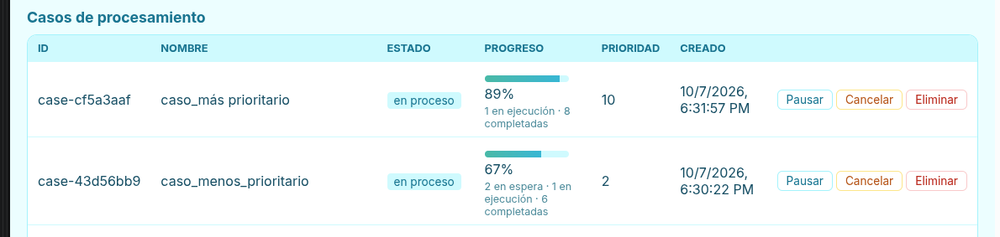
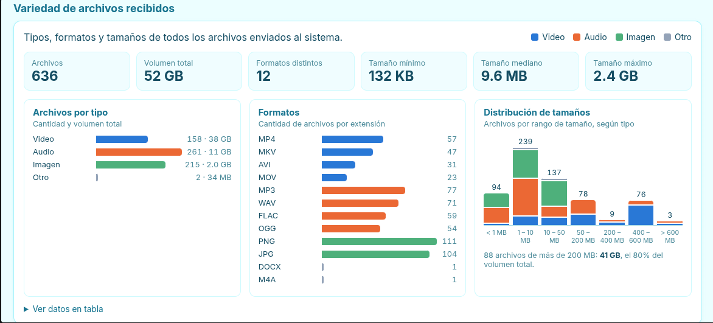
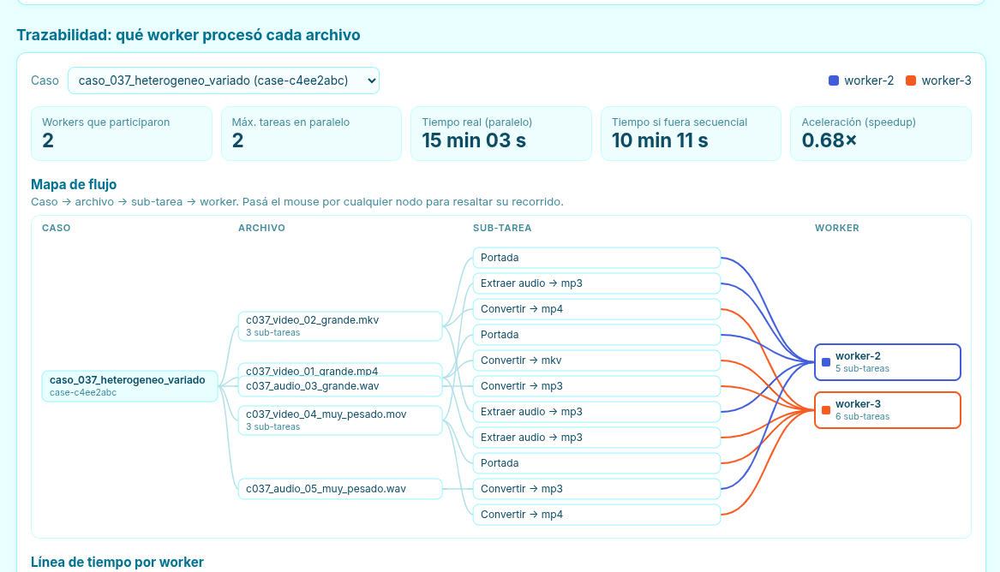

# Manual de usuario

Este manual describe el uso de la plataforma una vez que está en ejecución. Las instrucciones de instalación y despliegue están en el [README](../README.md).

La plataforma ofrece dos interfaces:

| Interfaz | Uso |
|---|---|
| **[Dashboard](#1-dashboard)** | Página web para enviar casos y monitorear el sistema |
| **[Cliente](#2-cliente-de-terminal)** | Programa de terminal para enviar lotes de casos y medir tiempos |

### Contenido

1. [Dashboard](#1-dashboard)
   - [Indicadores generales](#11-indicadores-generales) · [Colas](#12-colas) · [Envío de un caso](#13-envío-de-un-caso) · [Workers activos](#14-workers-activos)
   - [Casos](#15-casos) · [Detalle de un caso](#16-detalle-de-un-caso) · [Variedad de archivos](#17-variedad-de-archivos-recibidos) · [Trazabilidad](#18-trazabilidad)
2. [Cliente de terminal](#2-cliente-de-terminal)
3. [Generación del dataset de prueba](#3-generación-del-dataset-de-prueba)
4. [Solución de problemas](#4-solución-de-problemas)

---

## 1. Dashboard

El dashboard se abre en el navegador en `http://<IP del coordinador>:8000` (desde la computadora del coordinador, `http://localhost:8000`). La información se actualiza automáticamente cada 3 segundos.

Las secciones se describen a continuación en el orden en que aparecen en la página.

### 1.1 Indicadores generales

Totales del sistema: casos, casos en proceso, casos completados, workers conectados y **archivos procesados**. Un archivo se considera procesado cuando finalizaron todas sus sub-tareas.

### 1.2 Colas

Una tarjeta por cola (**video**, **audio** y **ligera**) indica **cuántas sub-tareas están en espera** y cuántos workers atienden esa cola.

> [!TIP]
> Si hay sub-tareas en espera y la tarjeta muestra el mensaje *nadie atiende este pool*, no hay ningún worker activo para esa cola.

### 1.3 Envío de un caso

En la sección **Nuevo caso**:

1. Escribir un nombre para el caso (opcional).
2. Seleccionar la **prioridad**, de 1 (baja) a 10 (alta). Un caso de mayor prioridad se procesa antes que los casos que ya estaban en espera.
3. Arrastrar los archivos al área punteada o hacer clic en ella para seleccionarlos. Se pueden combinar videos, audios e imágenes. El botón **×** quita un archivo de la lista.
4. Presionar **Enviar caso**. La página muestra el avance de la carga y, al finalizar, el identificador del caso creado.

> [!NOTE]
> Los archivos de un formato no soportado (por ejemplo, un PDF enviado desde el cliente) se marcan como **formato no soportado** y el resto del caso se procesa con normalidad.

### 1.4 Workers activos

Sobre la tabla se muestra un resumen, por ejemplo: *4 workers conectados en 4 máquinas distintas*.

| Columna | Información |
|---|---|
| **IP** | Dirección de origen de cada worker. La indicación *misma máquina que el coordinador* señala que se ejecuta en la misma computadora. |
| **Máquina** | Nombre del equipo, procesador, núcleos, RAM y sistema operativo |
| **Estado** | `libre`, `ocupado`, `saturado` (CPU elevada: no acepta tareas nuevas temporalmente) o `desconectado` (sin heartbeat durante más de 15 s) |
| **CPU / Memoria** | Uso actual |
| **Tareas** | Sub-tareas en ejecución |
| **Procesadas** | Total de sub-tareas finalizadas; permite observar la distribución del trabajo |
| **Versión** | `v5` si el worker está actualizado; `desactualizado` si debe reiniciarse |

Los workers desconectados se muestran en gris al final de la tabla y se pueden retirar de la lista con **Quitar**.

### 1.5 Casos

Cada fila corresponde a un caso e incluye su estado, una barra de avance, el tamaño total de sus archivos y la cantidad de sub-tareas en espera, en ejecución, completadas o fallidas.



| Estado | Descripción |
|---|---|
| `en cola` / `en proceso` | El caso tiene sub-tareas pendientes |
| `reintentando` | Una sub-tarea falló por un error de red y se volverá a intentar |
| `en pausa` | El caso fue pausado: las sub-tareas en ejecución finalizan y las demás esperan |
| `completado` | Todas las sub-tareas finalizaron correctamente |
| `parcialmente completado` | El caso finalizó, pero al menos una sub-tarea falló |
| `fallido` | Ninguna sub-tarea finalizó correctamente |
| `cancelado` | El caso fue cancelado |

**Acciones**

| Acción | Disponible | Efecto |
|---|---|---|
| *Clic en la fila* | Siempre | Abre el detalle del caso |
| **Pausar** | Mientras el caso no haya finalizado | Las sub-tareas en ejecución finalizan, pero las pendientes **no se inician** y los workers quedan disponibles para otros casos |
| **Reanudar** | Cuando el caso está en pausa | Las sub-tareas pendientes regresan a la cola y el caso continúa desde donde se detuvo |
| **Cancelar** | Mientras el caso no haya finalizado, incluso en pausa | Las sub-tareas restantes no se procesan y el caso se cierra |
| **Eliminar** | Siempre | Elimina el caso y todos sus archivos |

> [!WARNING]
> **Eliminar** es una acción irreversible: borra los archivos originales y los resultados del caso.

### 1.6 Detalle de un caso

En la parte superior se muestra un **resumen de una línea**, por ejemplo: *De 15 archivos — 6 miniaturas generadas, 4 audios convertidos…; 1 fallido por formato no soportado*.

A continuación, una tabla lista cada sub-tarea con su operación, su estado (con el porcentaje de avance durante la ejecución), el worker que la procesó y su duración. La columna **Resultado** contiene:

- **Descargar:** descarga el archivo resultante.
- **Ver error:** al colocar el cursor encima, muestra el motivo de la falla.
- Una nota con información adicional: el segundo del video del que se extrajo la portada, el álbum encontrado o el tamaño antes y después de la conversión.

| Botón | Función |
|---|---|
| **Ver reporte consolidado** | Abre el reporte completo del caso, que se puede imprimir o guardar como PDF |
| **Descargar JSON** | Descarga el mismo reporte en formato JSON |

### 1.7 Variedad de archivos recibidos

Gráficos de todos los archivos recibidos por el sistema:

- **Archivos por tipo:** cantidad de videos, audios e imágenes, y su volumen total.
- **Formatos:** cantidad de archivos por extensión (MP4, MKV, MP3, WAV, PNG…).
- **Distribución de tamaños:** cantidad de archivos por rango de tamaño, desde menos de 1 MB hasta más de 600 MB. Debajo del gráfico se indica el volumen de los archivos mayores a 200 MB.

La opción **Ver datos en tabla** presenta los mismos datos en formato de tabla.



### 1.8 Trazabilidad

Muestra **qué worker procesó cada sub-tarea**:

- **Mapa de flujo:** caso → archivo → sub-tarea → worker, con un color por worker. Al colocar el cursor sobre un elemento se resalta su recorrido.
- **Línea de tiempo:** una fila por worker y una barra por sub-tarea. **Las barras superpuestas corresponden a sub-tareas ejecutadas de forma simultánea**, lo que evidencia el paralelismo.
- **Resumen:** tiempo total real, tiempo estimado de una ejecución secuencial y **aceleración** obtenida (speedup).



---

## 2. Cliente de terminal

El cliente se ejecuta desde el directorio del proyecto, con el entorno virtual activado:

```bash
source .venv/bin/activate
```

Si el coordinador está en otra computadora, se debe definir su dirección antes de ejecutar el cliente:

```bash
export COORDINATOR_URL=http://192.168.1.100:8000
```

| Operación | Comando |
|---|---|
| Enviar un directorio como un caso | `python cliente/cliente.py enviar ./dataset_real/caso_022_heterogeneo` |
| Enviar todo el dataset (cada directorio es un caso) | `python cliente/cliente.py carga ./dataset_real --concurrentes 4 --metricas pruebas/carga.csv` |
| Enviar solo algunos casos | Agregar `--filtro heterogeneo` (casos cuyo nombre contiene esa palabra) o `--max-casos 5` |
| Agrupar casos automáticamente por evento | `python cliente/cliente.py auto ./dataset_real --por evento` (también `sesion`, `usuario` o `lote`) |
| Consultar el estado de un caso | `python cliente/cliente.py estado case-xxxxxxxx` |
| Descargar todos los resultados de un caso | `python cliente/cliente.py resultados case-xxxxxxxx --salida ./resultados_descargados` |
| Pausar un caso | `python cliente/cliente.py pausar case-xxxxxxxx` |
| Reanudar un caso | `python cliente/cliente.py reanudar case-xxxxxxxx` |
| Cancelar un caso | `python cliente/cliente.py cancelar case-xxxxxxxx` |
| Consultar el estado general | `python cliente/cliente.py resumen` |

Con la opción `--metricas`, el cliente **espera a que finalicen todos los casos** y muestra un resumen como el siguiente *(valores de ejemplo)*:

```text
MÉTRICAS DE LA PRUEBA
  Casos: 34  {'completed': 30, 'partially_completed': 4}
  Archivos: 480 · Sub-tareas: 560
  Tiempo total: 412.3 s
  Rendimiento: 69.8 archivos/min
  Tiempo secuencial estimado: 1103.5 s → speedup global 2.68×
  Reparto por worker:
    worker-1    210 sub-tareas (37.5%) · ...
```

Los datos se guardan en un archivo `.csv` y uno `.json` dentro de `pruebas/`, para su uso en el informe.

---

## 3. Generación del dataset de prueba

### Con archivos reales (recomendado; requiere conexión a internet)

```bash
python scripts/descargar_dataset.py
```

- Descarga videos, canciones y fotografías de Wikimedia Commons, todos con licencia libre.
- A partir de ellos genera **~480 archivos** organizados en casos homogéneos (un solo tipo de archivo) y heterogéneos (tipos combinados), con tamaños livianos, medianos y pesados, y **10 archivos de 400–600 MB**.
- Ocupa aproximadamente 9 GB y se guarda en `dataset_real/`.
- Los créditos de cada archivo original se registran en `dataset_real/CREDITOS.md`.

**Opciones:**

| Opción | Descripción |
|---|---|
| `--limpiar` | Regenera todo el dataset (reutiliza los archivos ya descargados) |
| `--pesados-desde 22` | Conserva los casos 1 a 21 y regenera del 22 en adelante como casos heterogéneos compuestos solo por archivos pesados |
| `--muy-pesados 0` | Omite los archivos de 400–600 MB |
| `--ligero` | Genera archivos pequeños, para pruebas rápidas |

### Sin conexión a internet (archivos sintéticos: patrones de color y tonos)

```bash
python scripts/generar_dataset.py
```

---

## 4. Solución de problemas

| Síntoma | Solución |
|---|---|
| Todas las sub-tareas fallan con `Error opening input file uploads/...` | El worker es de una versión anterior. Se debe reiniciar y, si se ejecuta con Docker, reconstruir la imagen (`docker build -t worker .`). |
| Un worker aparece conectado, pero no se está ejecutando en ninguna terminal | El worker se ejecuta en segundo plano. Se puede localizar con `docker ps` y detener con `docker stop <nombre>`. |
| Hay sub-tareas en espera que ningún worker procesa | No hay ningún worker activo para esa cola. Se debe iniciar uno. |
| Un worker permanece **saturado** durante mucho tiempo | La computadora está ocupada con otros procesos. El worker se recupera automáticamente cuando baja el uso de CPU. |
| `permission denied ... docker.sock` | Ejecutar `docker` con `sudo`. |
| Al enviar casos grandes se obtiene `400 Bad Request` | El coordinador es de una versión anterior y se debe reiniciar. |
| Las horas mostradas no coinciden con la hora local | Reiniciar el coordinador. |
